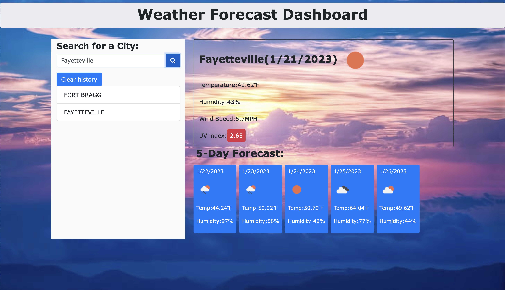

# Mod-6-weather-app

## User Story

AS A traveler
I WANT to see the weather outlook for multiple cities
SO THAT I can plan a trip accordingly

## Acceptance Criteria

GIVEN a weather dashboard with form inputs
WHEN I search for a city
THEN I am presented with current and future conditions for that city and that city is added to the search history
WHEN I view current weather conditions for that city
THEN I am presented with the city name, the date, an icon representation of weather conditions, the temperature, the humidity, and the the wind speed
WHEN I view future weather conditions for that city
THEN I am presented with a 5-day forecast that displays the date, an icon representation of weather conditions, the temperature, the wind speed, and the humidity
WHEN I click on a city in the search history
THEN I am again presented with current and future conditions for that city

## Technologies used

- HTML
- CSS
- JavaScript
- Bootstrap
- jQuery
- OpenWeatherMap API

## Description

This is a weather app that allows the user to search for a city and see the current weather and a 5-day forecast. The user can also see the history of cities they have searched for. The app uses the OpenWeatherMap API to get the weather data. 

## Installation

To install this app, clone the repository and open the index.html file in your browser; you could also open the app by using the link for the deploy application.

## Usage

To use this app, enter a city name in the search bar and click the search button. The current weather and a 5-day forecast will be displayed. The city name will also be added to the search history. To see the weather for a city in the search history, click on the city name.

## Deployment

- GitHub Repository: git@github.com:mia2380/Mod-6-weather-app.git

- GitHub Pages: https://mia2380.github.io/Mod-6-weather-app/

## Screenshot

## Credits

- [OpenWeatherMap API](https://openweathermap.org/api)
- [Moment.js](https://momentjs.com/)
- [Bootstrap](https://getbootstrap.com/)
- [jQuery](https://jquery.com/)
- [Font Awesome](https://fontawesome.com/)
- [Google Fonts](https://fonts.google.com/)

## License

MIT License
